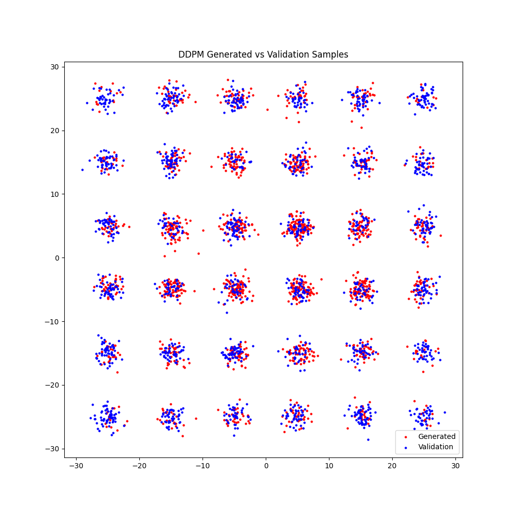
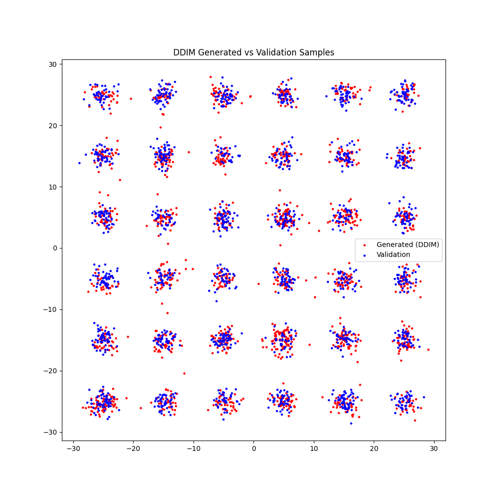

# Deep Generative Models: Comprehensive Implementation and Analysis

<p align="center">
  
  
</p>

## 🌟 Project Overview

This repository presents a comprehensive implementation and comparative analysis of state-of-the-art deep generative models for distribution learning and sample generation. The project explores multiple cutting-edge architectures to understand their theoretical foundations, implementation nuances, and practical performance in modeling complex data distributions.

The implemented models represent the evolution of generative AI research, from traditional approaches like GANs to the more recent diffusion-based models that have revolutionized the field of generative modeling.

## 🚀 Implemented Models

This project implements four major families of generative models:

### 1. Variational Autoencoders (VAE)
- Fully implemented encoder-decoder architecture with reparameterization trick
- Optimized ELBO loss function with KL divergence regularization
- Flexible latent space dimensionality for different modeling capacities

### 2. Generative Adversarial Networks (GAN)
- Robust implementation with optimized generator and discriminator networks
- BCE loss function with adaptive training schemes
- Stable training dynamics through careful hyperparameter tuning

### 3. Denoising Diffusion Probabilistic Models (DDPM)
- Forward and reverse diffusion processes with predefined noise schedules
- Sinusoidal time embeddings for effective timestep conditioning
- MSE loss for noise prediction with high-quality sample generation

### 4. Denoising Diffusion Implicit Models (DDIM)
- Accelerated sampling with deterministic non-Markovian processes
- Configurable number of sampling steps for quality-speed tradeoffs
- Implementation of stochasticity parameter (η) for controlling randomness

## 📊 Data

The project uses synthetic Gaussian Mixture Model (GMM) datasets for training and evaluation, providing a clear visual representation of how each model learns complex multimodal distributions. This synthetic data approach allows for:

- Controlled complexity testing
- Clear visual assessment of mode coverage
- Precise quantitative evaluation metrics

## 📈 Evaluation Metrics

The generative models are comprehensively evaluated using:

- Fréchet Inception Distance (FID) for measuring sample quality
- KL Divergence for distribution matching assessment
- Visual inspection of generated vs. real data distributions
- Comparative training dynamics and convergence rates

## 🔍 Key Features

- **Modular Implementation**: Well-structured code that isolates model architectures, training procedures, and evaluation metrics
- **Comparative Analysis**: Direct comparison of different generative paradigms on identical data
- **Visualization Tools**: Comprehensive visualization utilities for qualitative assessment
- **Optimized Training**: Carefully tuned hyperparameters and training schedules for each model type
- **Theoretical Context**: Implementations grounded in mathematical foundations of generative modeling

## 🛠️ Project Structure

```
Generative_Models/
├── gan.py            # GAN implementation with training and evaluation
├── vae.py            # VAE implementation with ELBO optimization
├── ddpm.py           # DDPM implementation with noise prediction
├── ddim.py           # DDIM implementation with accelerated sampling
├── data.py           # Data generation and preprocessing utilities
├── utils.py          # Evaluation metrics and visualization tools
├── configs/          # Configuration files for model parameters
├── results/          # Generated outputs and evaluation results
├── data/             # Dataset storage
└── saved_models/     # Trained model checkpoints
```

## 📝 Technical Implementation Details

The models incorporate several advanced techniques:

- **Architectural Innovations**: Optimized network architectures for each generative paradigm
- **Stochastic Optimization**: Adam optimizer with learning rate scheduling
- **Regularization Techniques**: Various regularization approaches to prevent overfitting
- **Batch Normalization**: For training stability in deeper networks
- **Activation Functions**: Strategic use of SiLU, LeakyReLU, and other activations

## 🔮 Future Work

- Integration of more recent generative architectures (e.g., Diffusion Transformers)
- Extension to higher-dimensional data domains
- Implementation of conditional generation capabilities
- Exploration of hybrid model architectures
- Optimization for computational efficiency

## 🔗 References

This implementation draws from seminal papers in generative modeling:

- Kingma and Welling. "Auto-Encoding Variational Bayes." ICLR 2014
- Goodfellow et al. "Generative Adversarial Networks." NeurIPS 2014
- Ho et al. "Denoising Diffusion Probabilistic Models." NeurIPS 2020
- Song et al. "Denoising Diffusion Implicit Models." ICLR 2021

---

This project demonstrates comprehensive understanding of deep generative models from mathematical foundations to practical implementations, showcasing both theoretical knowledge and applied machine learning expertise. 